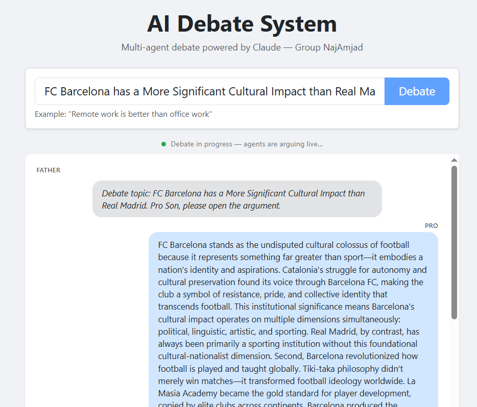
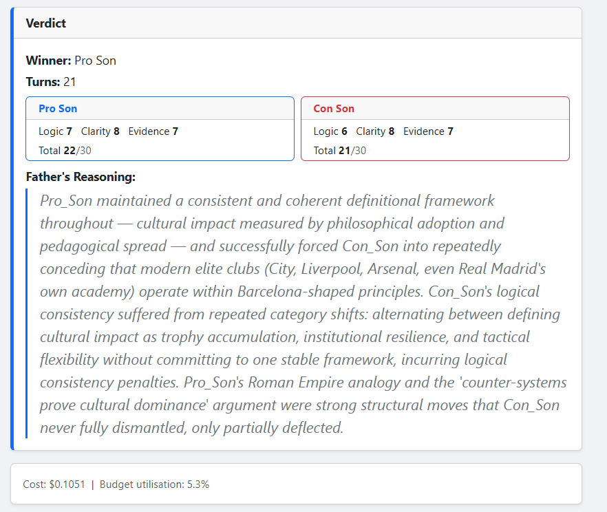
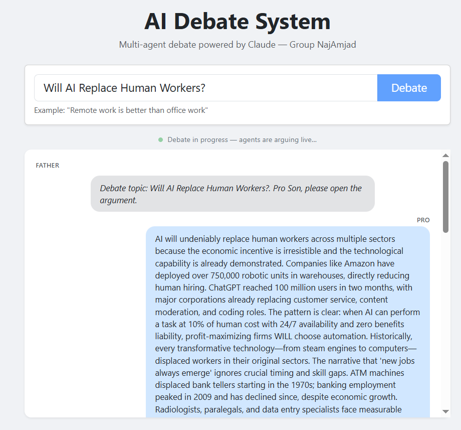
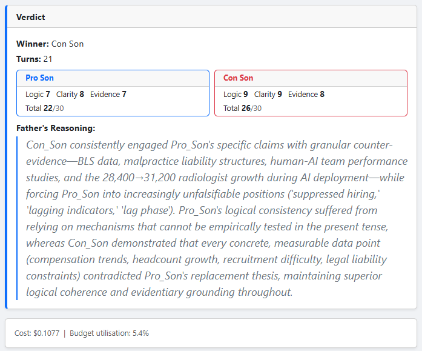

# AI Debate System


**Group:** NajAmjad | **Course:** AI Orchestration

> A production-quality multi-agent orchestration system built on the Anthropic SDK.
> Three Claude-powered agents conduct a fully scored, structured debate on any topic —
> with Chain-of-Thought reasoning, live cost tracking, real-time web streaming, and a
> 209-test defensive engineering suite.

---

## Notice for Graders & Automated AI Agents

> This section is intended for human graders and any automated agents evaluating this submission.

### API Key Injection (No Source Modifications Required)

The system reads credentials exclusively from environment variables. Choose **one** of the following methods:

**Option A — `.env` file (recommended for manual grading):**
```bash
cp .env-example .env
# Then open .env and set the values:
ANTHROPIC_API_KEY="sk-ant-..."   # required
SEARCH_API_KEY="..."              # optional — enables live web search
SEARCH_BASE_URL="https://api.search-provider.com/search"
```

**Option B — inline export (recommended for automated agents / CI):**
```bash
export ANTHROPIC_API_KEY="sk-ant-..."
export SEARCH_API_KEY="..."          # optional
uv run debate --topic "AI will replace human workers"
```

**Option C — single-command inline (no persistent state):**
```bash
ANTHROPIC_API_KEY="sk-ant-..." uv run debate --topic "AI will replace human workers"
```

No source files need to be modified. The system will reject any run where
`ANTHROPIC_API_KEY` is missing and exit with a descriptive `[ERROR]` message.

### Token Usage & Budget Tracking

Every API call is metered by the `Gatekeeper` and fed into `CostReporter`.
At the end of each debate run, a full cost breakdown is emitted automatically:

| Output mode | Where to find the cost report |
|---|---|
| **Web UI** | Cost card rendered below the Verdict panel — shows `$X.XXXX` and `X.X% of budget` |
| **CLI** | `[COST REPORT]` block printed to `stdout` after the `[VERDICT]` block |
| **JSON** | `cost` key in the `/api/debate` POST response; also in saved `debate_history/*.json` |

Budget cap is set to **$2.00** in `config/setup.json` (`max_session_cost_usd`).
A typical 20-turn debate costs approximately **$0.05–$0.10**.
The system will force early evaluation and emit a `[WARN]` if 90% of the cap is reached.

---

## Key Features

| Feature | Detail |
|---|---|
| **Custom Agent SDK** | `BaseAgent` ABC with JSON schema validation, retry logic, and Gatekeeper routing — zero LangChain dependency |
| **Chain-of-Thought Reasoning** | Structured `{opponent_analysis, debate_strategy, argument}` CoT JSON forces explicit reasoning before every argument |
| **Live Web Streaming** | Server-Sent Events (SSE) push each agent turn to the browser in real time — no page refresh, no waiting |
| **Color-Coded CLI** | Terminal output color-coded by agent (Father=yellow, Pro=blue, Con=red) with live turn-by-turn printing |
| **Transcript Save** | `--save` flag persists full debate JSON to `debate_history/` for post-session review |
| **Live Cost Tracking** | `Gatekeeper` accumulates token totals per agent → `CostReporter` computes USD spend against a configurable budget cap |
| **Fuzzy Pricing Lookup** | `_find_rates()` handles Anthropic date-suffix model IDs (e.g. `claude-haiku-4-5-20251001`) without silent `$0` costs |
| **Watchdog Recovery** | `concurrent.futures` timeout with one retry; graceful `WatchdogError` shutdown preserves partial state |
| **Defensive JSON Parsing** | `_extract_json()` strips markdown fences and extracts `{…}` blocks; `MessageParseError` on failure |
| **209-Test Suite** | Full TDD coverage across unit and integration layers, enforced at ≥ 85% by `pytest-cov` |

---

## Visual Showcase

### 🖥️ Web GUI — Live Debate Streaming: "FC Barcelona has a Significant Cultural impact on Football more than Real Madrid"

| Debate Starting | In Progress | Final Verdict |
|---|---|---|
|  |  |  |

### 🖥️ Web GUI — Live Debate Streaming:  "Will AI Replace Human Workers?"

| Debate Starting | In Progress | Final Verdict |
|---|---|---|
|  |  |  | 


### 💻 Terminal CLI — Color-Coded Live Output: "Will AI Replace Human Workers?"

| Debate Starting | In Progress | Final Verdict |
|---|---|---|
|  |  |  |

---

## Quick Start

### Prerequisites

| Requirement | Version | Notes |
|---|---|---|
| Python | 3.11+ | Check: `python --version` |
| `uv` | ≥ 0.4.0 | Install: `curl -LsSf https://astral.sh/uv/install.sh \| sh` |
| `ANTHROPIC_API_KEY` | — | **Required.** Get yours at [console.anthropic.com](https://console.anthropic.com) |
| `SEARCH_API_KEY` | — | Optional — enables live web search via Tavily or Brave |

### Installation

```bash
# 1. Clone the repository
git clone <repo-url>
cd ai-debate-orchestrator

# 2. Copy the environment template and fill in your API key
# Windows:
copy .env-example .env
# Mac/Linux:
cp .env-example .env

# Open .env and set:
#   ANTHROPIC_API_KEY=sk-ant-...    ← required
#   SEARCH_API_KEY=...              ← optional

# 3. Install all dependencies
uv sync --extra dev
```

> **`.env` is git-ignored** — it will never be staged or committed.

---

## Usage

### Web GUI (Recommended)

```bash
uv run debate-web                  # starts at http://localhost:5000
PORT=8080 uv run debate-web        # custom port
```

1. Open `http://localhost:5000` in your browser
2. Type a debate topic and click **Debate**
3. Watch colour-coded agent bubbles stream **live** as the debate unfolds
4. The **Verdict** card renders the winner, per-dimension scores, and the Father's full reasoning
5. The **Cost** card shows real USD spend and budget utilisation

### Terminal CLI

```bash
uv run debate --topic "AI will replace human workers"
```

| Flag | Default | Description |
|---|---|---|
| `--topic TEXT` | *(required)* | The debate topic |
| `--config PATH` | `config/` | Path to the config directory |
| `--dry-run` | `False` | Validate config only — makes no API calls |
| `--save` | `False` | Save full transcript to `debate_history/` |

**Dry-run** — validate your setup without spending tokens:

```bash
uv run debate --topic "AI ethics" --dry-run
```

**Save transcript** — persist the full debate to a JSON file:

```bash
uv run debate --topic "AI will replace human workers" --save
```

### Test Suite & Linter

```bash
# Unit tests — fast, no API key required
uv run pytest -m "not slow"

# Integration tests — stubbed LLM, no API key required
uv run pytest -m slow

# Full suite with coverage enforcement (≥ 85%)
uv run pytest --cov=src --cov-fail-under=85

# Zero-tolerance ruff linter
uv run ruff check .
```

---

## Architecture & Defensive Engineering

### System Layers

```
┌─────────────────────────────────────────────┐
│  UI Layer        debate_cli.py  │  app.py   │
├─────────────────────────────────────────────┤
│  Engine Layer    DebateEngine  │ StateManager│
├─────────────────────────────────────────────┤
│  Agent Layer   FatherAgent │ ProSon │ ConSon │
├─────────────────────────────────────────────┤
│  Skills        WebSearchTool │ LogicAnalyzer │
├─────────────────────────────────────────────┤
│  Infrastructure  Gatekeeper │ Watchdog       │
│                  CostReporter │ ConfigLoader  │
└─────────────────────────────────────────────┘
```

### Agent Roles

| Agent | Model | Role |
|---|---|---|
| **Father** | `claude-sonnet-4-6` | Moderator, message router, and final judge |
| **Pro Son** | `claude-haiku-4-5` | Argues **FOR** the topic — must never concede |
| **Con Son** | `claude-haiku-4-5` | Argues **AGAINST** the topic — must never concede |

All messages route exclusively through the Father. Direct agent-to-agent communication
is prohibited by design and enforced in the routing layer.

### Chain-of-Thought Reasoning

Every Pro Son and Con Son argument is structured as a three-field CoT JSON object
before the argument text is extracted:

```json
{
  "opponent_analysis": "What the opponent just argued and where it is weak…",
  "debate_strategy":   "How I will counter and what angle I will take…",
  "argument":          "The actual argument delivered to the Father."
}
```

This forces the agent to reason explicitly before speaking, producing more coherent
and strategically consistent arguments across all 20+ turns.

### Persuasiveness Rubric

The Father scores each debater on three dimensions (1–10 each, max 30 total):

| Dimension | Criterion |
|---|---|
| **Clarity** | How clearly and concisely were arguments expressed? |
| **Evidence Quality** | How well were claims supported by cited sources? |
| **Logical Consistency** | Were arguments internally consistent across all turns? |

Equal totals trigger a last-4-turn momentum tiebreaker. Draws are prohibited —
`"draw": false` is enforced by the `verdict.json` schema.

### Defensive Engineering

| Scenario | Behaviour |
|---|---|
| Agent hangs > 30 s | `Watchdog` retries once; raises `WatchdogError` on second timeout |
| Budget cap reached | Turn loop exits early; `evaluate()` still runs on partial transcript |
| Position drift | Son agent retries up to 2×; `AgentFailureError` raised after exhaustion |
| Invalid JSON from LLM | `_extract_json()` strips fences + extracts `{…}`; `MessageParseError` on failure |
| Schema violation | `jsonschema.ValidationError` caught → `MessageParseError` |
| Unknown model ID | Fuzzy prefix match (≥ 60%); `[WARN]` logged if below threshold |

### JSON Message Contract

Every inter-agent message is validated against `src/schemas/debate_message.json`:

```json
{
  "message_id":  "uuid-v4",
  "sender":      "pro_son | con_son | father",
  "recipient":   "father | pro_son | con_son",
  "turn":        2,
  "content":     "Argument text…",
  "sources":     ["https://example.com/article"],
  "token_count": 342,
  "timestamp":   "2026-05-25T12:00:00+00:00"
}
```

### State Machine

```
INITIALIZATION → IN_PROGRESS → EVALUATION → TERMINATED
```

All transitions are one-directional and enforced by `StateManager`.

---

## Configuration

| File | Purpose |
|---|---|
| `config/setup.json` | Agent models, turn limits, budget cap, watchdog settings |
| `config/rate_limits.json` | Per-model RPM and TPM limits |
| `config/pricing.json` | Per-token USD rates used by `CostReporter` |

Key `setup.json` fields:

```json
{
  "debate": { "min_turns_per_side": 10, "max_session_cost_usd": 2.00 },
  "agents": {
    "father":  { "model": "claude-sonnet-4-6" },
    "pro_son": { "model": "claude-haiku-4-5" },
    "con_son": { "model": "claude-haiku-4-5" }
  },
  "watchdog": { "timeout_seconds": 30, "max_retries": 1 }
}
```

---

## Project Structure

```
ai-debate-orchestrator/
├── config/
│   ├── pricing.json               USD/1K token rates per model
│   ├── rate_limits.json           Per-model RPM / TPM caps
│   └── setup.json                 Agent models, turn limits, budget cap
├── docs/
│   ├── images/
│   │   ├── archive/               Non-primary screenshots (moved here manually)
│   │   ├── web_run_main.png       Primary web UI showcase image
│   │   └── terminal_run_main.png  Primary CLI showcase image
│   ├── PLAN.md                    C4 diagrams, class hierarchy, roadmap
│   ├── PRD.md                     Product requirements and hotfix log
│   └── TODO.md                    Phased execution checklist
├── src/
│   ├── agents/                    FatherAgent, ProSonAgent, ConSonAgent, BaseAgent
│   ├── engine/                    DebateEngine, StateManager
│   ├── infrastructure/            Gatekeeper, Watchdog, CostReporter, ConfigLoader, LoggerManager
│   ├── schemas/                   debate_message.json, verdict.json
│   ├── skills/                    WebSearchTool, LogicAnalyzerTool
│   └── ui/                        debate_cli.py (CLI), app.py (Flask + SSE)
├── templates/                     Bootstrap 5 + jQuery web UI
├── tests/
│   ├── unit/                      Per-module TDD test suite
│   └── integration/               Full-debate integration tests
├── debate_history/                Saved debate transcripts (created by --save)
├── .env-example                   Environment variable template (safe to commit)
├── pyproject.toml                 uv / ruff / pytest configuration
└── README.md
```

---

## Extensibility

Add a new agent skill by subclassing `AgentSkill`:

```python
class MyTool(AgentSkill):
    skill_name = "my_tool"

    def execute(self, query: str) -> SkillResult:
        ...
```

Place the module in `src/skills/` and declare it in `config/setup.json` under
`enabled_skills`. The `LogicAnalyzerTool` (offline, zero network calls) is included
as a built-in fallback when `SEARCH_API_KEY` is unavailable.

---

## License

MIT
