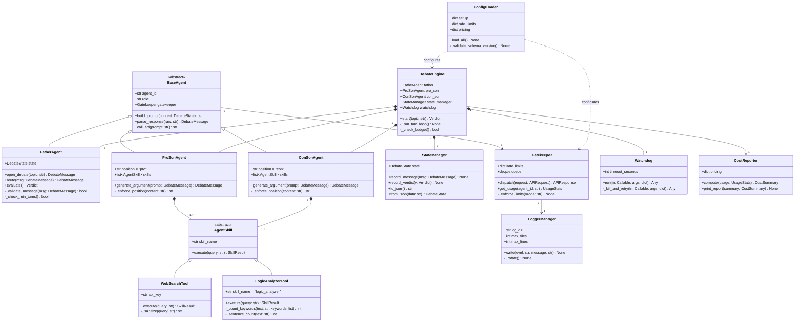

# Architectural Blueprint
## AI Debate System — Assignment 2
**Project:** AI Orchestration Course — Group NajAmjad
**Version:** 2.1.0
**Date:** 2026-05-27
**Status:** Final — v2.1.0

---

## 1. C4 Model Overview

### 1.1 Level 1 — System Context

```
┌─────────────────────────────────────────────────────────────┐
│                        SYSTEM BOUNDARY                      │
│                                                             │
│   ┌──────────┐    topic / verdict    ┌─────────────────┐   │
│   │   User   │ ────────────────────► │  AI Debate CLI  │   │
│   └──────────┘ ◄──────────────────── └────────┬────────┘   │
│                                               │             │
│                                    ┌──────────▼──────────┐ │
│                                    │  Debate Orchestrator│ │
│                                    │  (SDK Layer)        │ │
│                                    └──────────┬──────────┘ │
│                          ┌──────────────┬─────┘            │
│                          │              │                   │
│                   ┌──────▼──────┐ ┌────▼──────┐           │
│                   │ LLM Provider│ │ Web Search │           │
│                   │ (Anthropic/ │ │ API        │           │
│                   │  DeepSeek/  │ └───────────┘           │
│                   │  Qwen/other)│                          │
│                   └─────────────┘                          │
└─────────────────────────────────────────────────────────────┘
```

### 1.2 Level 2 — Container Diagram

```
┌─────────────────────────────────────────────────────────────────┐
│  AI Debate System                                               │
│                                                                 │
│  ┌──────────────┐    ┌──────────────────────────────────────┐  │
│  │  CLI / UI    │    │           SDK Layer                  │  │
│  │  Layer       │───►│  ┌──────────┐  ┌──────────────────┐  │  │
│  │              │    │  │ Debate   │  │  API Gatekeeper  │  │  │
│  │  debate_cli  │    │  │ Engine   │  │  + Rate Limiter  │  │  │
│  │              │    │  └────┬─────┘  └────────┬─────────┘  │  │
│  └──────────────┘    │       │                 │             │  │
│                      │  ┌────▼─────────────────▼──────────┐ │  │
│                      │  │         Agent Layer              │ │  │
│                      │  │  ┌──────────┐ ┌──────┐ ┌──────┐ │ │  │
│                      │  │  │  Father  │ │ Pro  │ │ Con  │ │ │  │
│                      │  │  │  Agent   │ │ Son  │ │ Son  │ │ │  │
│                      │  │  └──────────┘ └──────┘ └──────┘ │ │  │
│                      │  └──────────────────────────────────┘ │  │
│                      │  ┌──────────┐  ┌──────────────────┐   │  │
│                      │  │ Watchdog │  │  Logging Manager │   │  │
│                      │  └──────────┘  └──────────────────┘   │  │
│                      └──────────────────────────────────────┘  │
└─────────────────────────────────────────────────────────────────┘
```

### 1.3 Level 3 — Component Interactions (Message Flow)

```
User ──topic──► DebateEngine.start()
                    │
                    ▼
              FatherAgent.open_debate()
                    │
          ┌─────────▼──────────┐
          │  Turn Loop (×20+)  │
          │                    │
          │  FatherAgent ──JSON──► ProSonAgent
          │       ▲                    │ web_search()
          │       └────JSON────────────┘
          │                    │
          │  FatherAgent ──JSON──► ConSonAgent
          │       ▲                    │ web_search()
          │       └────JSON────────────┘
          └─────────────────────┘
                    │
              FatherAgent.evaluate()
                    │
                    ▼
              Verdict JSON ──► CLI output + CostReport
```

---

## 2. Layered Architecture

```
┌─────────────────────────────────────────────────┐
│               CLI / UI Layer                    │
│  debate_cli.py  |  report_printer.py            │
│  (≤150 lines each, zero business logic)         │
├─────────────────────────────────────────────────┤
│              Orchestration Layer                │
│  debate_engine.py  |  state_manager.py          │
│  (Coordinates agents, enforces turn rules)      │
├─────────────────────────────────────────────────┤
│               Agent Layer                       │
│  father_agent.py  |  pro_son_agent.py           │
│  con_son_agent.py  |  base_agent.py             │
│  (Agent logic, JSON parsing, retry)             │
├─────────────────────────────────────────────────┤
│               Tools Layer                       │
│  web_search_tool.py  |  logic_analyzer_tool.py  │
│  base_skill.py                                  │
│  (Skill interface implementations)              │
├─────────────────────────────────────────────────┤
│             Infrastructure Layer               │
│  gatekeeper.py  |  llm_provider.py              │
│  watchdog.py    |  cost_reporter.py             │
│  logger_manager.py  |  config_loader.py         │
└─────────────────────────────────────────────────┘
```

---

## 3. OOP Class Diagram (Mermaid)



---

## 4. Core Mechanisms

### 4.1 API Gatekeeper & Provider Abstraction

**Purpose:** Single choke-point for all outbound LLM API calls; provider-agnostic
since v2.1.0.

**Provider abstraction (`src/infrastructure/llm_provider.py`):**
- `LLMProvider` — abstract base class with a single `complete(model, prompt, max_tokens) → LLMResponse` method.
- `AnthropicProvider` — wraps `anthropic.Anthropic().messages.create()`; selected when `ANTHROPIC_API_KEY` is set.
- `OpenAICompatibleProvider` — wraps `openai.OpenAI(base_url=..., api_key=...)`; selected when `LLM_API_KEY` or `OPENAI_API_KEY` is set. Compatible with DeepSeek, Qwen (DashScope), OpenAI, Ollama, and any OpenAI-compatible endpoint.
- `build_provider()` — factory that auto-detects the provider from environment variables (priority: `LLM_PROVIDER` → `ANTHROPIC_API_KEY` → `LLM_API_KEY`/`OPENAI_API_KEY`).
- The `Gatekeeper` accepts an optional `provider` constructor argument; `build_provider()` is called lazily on the first `_make_api_call` if none is supplied.

**Gatekeeper behaviour:**
- Loads `config/rate_limits.json` on startup.  Unknown models fall back to the `"default"` key (60 RPM) so any provider model works without a config change.
- Maintains a per-model token bucket (requests per minute).
- Excess requests enter a bounded FIFO queue (max 50 items).
- Exposes `get_usage(agent_id)` returning cumulative token counts for cost reporting.
- Thread-safe; uses `threading.Lock` internally.

**Config schema (`rate_limits.json`):**
```json
{
  "schema_version": "1.0",
  "default": { "rpm": 60, "tpm": 100000 },
  "models": {
    "claude-sonnet-4-6": { "rpm": 50, "tpm": 40000 },
    "claude-haiku-4-5":  { "rpm": 100, "tpm": 100000 },
    "deepseek-chat":     { "rpm": 60,  "tpm": 100000 },
    "qwen-turbo":        { "rpm": 60,  "tpm": 100000 },
    "gpt-4o-mini":       { "rpm": 500, "tpm": 200000 }
  },
  "web_search": { "rpm": 30 }
}
```

### 4.2 Watchdog & Timeout Manager

**Purpose:** Detect and recover from stuck or hung LLM calls.

**Behaviour:**
- Wraps every `call_api()` invocation in a `concurrent.futures.ThreadPoolExecutor`.
- Timeout value loaded from `config/setup.json` (`watchdog_timeout_seconds`, default 30).
- On timeout: logs a WARNING, cancels the future, and retries the call once.
- On second timeout: raises `WatchdogError`; debate engine handles graceful shutdown.
- Watchdog events are written to the log and appended to `DebateState.events`.

**Sequence:**
```
Watchdog.run(fn, args)
    └─ submit fn to executor
    └─ wait timeout_seconds
    └─ if TimeoutError → log + retry once
    └─ if TimeoutError again → raise WatchdogError
    └─ else → return result
```

### 4.3 Logging Manager

**Purpose:** Structured, FIFO-rotated file logging.

**Behaviour:**
- Log directory: `logs/` (path from `config/setup.json`).
- Files named: `debate_{timestamp}.log`.
- Maximum 20 files retained; oldest deleted when limit exceeded.
- Each file capped at 500 lines; new file opened automatically on overflow.
- Log levels: DEBUG, INFO, WARNING, ERROR.
- Format: `{ISO-timestamp} | {level} | {component} | {message}`.
- No external logging libraries beyond the Python standard `logging` module.

### 4.4 JSON Message Router (Father)

**Purpose:** Enforce the communication contract; no direct agent-to-agent messages.

**Behaviour:**
1. Receives a raw string from an LLM response.
2. Parses to `DebateMessage` (raises `MessageParseError` on failure).
3. Validates against JSON schema; rejects and retries on schema violation.
4. Checks `sender` and `recipient` fields for routing legitimacy.
5. Appends to `DebateState.transcript` via `StateManager`.
6. Forwards to the target agent or triggers verdict if turn limit reached.

---

## 5. Configuration Strategy

### 5.1 File Map

| File | Committed | Contains |
|------|-----------|---------|
| `.env` | No | `ANTHROPIC_API_KEY` or `LLM_API_KEY` + `LLM_BASE_URL`, `SEARCH_API_KEY` |
| `.env-example` | Yes | Placeholder keys, comments for all providers |
| `config/setup.json` | Yes | Model names, turn limits, paths, budget cap |
| `config/rate_limits.json` | Yes | Per-model RPM/TPM caps + `"default"` fallback for unknown models |
| `config/pricing.json` | Yes | USD/1K token rates for Anthropic, DeepSeek, Qwen, and OpenAI models |

### 5.2 `setup.json` Structure

```json
{
  "schema_version": "1.0",
  "debate": {
    "min_turns_per_side": 10,
    "max_session_cost_usd": 2.00
  },
  "agents": {
    "father": { "model": "claude-sonnet-4-6" },
    "pro_son": { "model": "claude-haiku-4-5" },
    "con_son": { "model": "claude-haiku-4-5" }
  },
  "watchdog": {
    "timeout_seconds": 30,
    "max_retries": 1
  },
  "logging": {
    "log_dir": "logs/",
    "max_files": 20,
    "max_lines_per_file": 500
  },
  "enabled_skills": ["web_search"]
}
```

### 5.3 `.env-example`

```
# Option A: Anthropic Claude (default)
ANTHROPIC_API_KEY=your_key_here

# Option B: Any OpenAI-compatible provider (DeepSeek, Qwen, OpenAI, Ollama…)
# LLM_API_KEY=your_key_here
# LLM_BASE_URL=https://api.deepseek.com

# Optional: explicit provider override
# LLM_PROVIDER=anthropic  # or: openai | deepseek | qwen | openai_compatible

# Web Search API (e.g. Brave Search / Tavily)
SEARCH_API_KEY=your_key_here
SEARCH_BASE_URL=https://api.example.com/search
```

---

## 6. Directory Structure

```
A2/
├── config/
│   ├── pricing.json
│   ├── rate_limits.json
│   └── setup.json
├── docs/
│   ├── images/          # Screenshots for README
│   ├── PLAN.md
│   ├── PRD.md
│   └── TODO.md
├── examples/            # Sample debate transcript and output
├── logs/                # git-ignored, created at runtime
├── templates/
│   └── index.html       # Bootstrap 5 + jQuery SSE chat interface
├── src/
│   ├── agents/
│   │   ├── __init__.py
│   │   ├── base_agent.py
│   │   ├── con_son_agent.py
│   │   ├── father_agent.py
│   │   └── pro_son_agent.py
│   ├── engine/
│   │   ├── __init__.py
│   │   ├── debate_engine.py
│   │   └── state_manager.py
│   ├── infrastructure/
│   │   ├── __init__.py
│   │   ├── config_loader.py
│   │   ├── cost_reporter.py
│   │   ├── gatekeeper.py
│   │   ├── llm_provider.py    ← NEW: LLMProvider ABC + AnthropicProvider + OpenAICompatibleProvider
│   │   ├── logger_manager.py
│   │   └── watchdog.py
│   ├── schemas/
│   │   ├── debate_message.json
│   │   └── verdict.json
│   ├── skills/
│   │   ├── __init__.py
│   │   ├── base_skill.py
│   │   ├── logic_analyzer_tool.py
│   │   └── web_search_tool.py
│   └── ui/
│       ├── __init__.py
│       ├── app.py       # Flask application factory + SSE streaming route (148 lines)
│       └── debate_cli.py
├── tests/
│   ├── unit/
│   └── integration/
├── .env-example
├── .gitignore
├── pyproject.toml
└── README.md
```

---

## 7. Technology Stack

| Concern | Choice | Rationale |
|---------|--------|-----------|
| Runtime | Python 3.11+ | Async support, typing, standard library |
| Package manager | `uv` | Fast, reproducible, PEP 517 compliant |
| LLM SDK (Anthropic) | `anthropic` (official) | First-class Messages API support |
| LLM SDK (other providers) | `openai` | Universal OpenAI-compatible client for DeepSeek, Qwen, OpenAI, Ollama |
| Linting | `ruff` | Zero-config, replaces flake8 + isort |
| Testing | `pytest` + `pytest-cov` | Mature, widely supported |
| JSON Schema | `jsonschema` | RFC-compliant validation |
| Env loading | `python-dotenv` | Industry standard |
| Web Search | Tavily / Brave API | Configurable via `.env` |

---

## 8. Risk & Mitigation

| Risk | Likelihood | Impact | Mitigation |
|------|-----------|--------|-----------|
| LLM breaks position constraint | Medium | High | Position enforcer + retry (max 2) |
| API rate limit exceeded | Medium | Medium | Gatekeeper with token bucket |
| Runaway cost overrun | Low | High | Budget cap in setup.json |
| Hung API call | Low | High | Watchdog with 30s timeout |
| JSON parse failure | Medium | Medium | Schema validation + retry |
| Log disk overflow | Low | Low | FIFO rotation: 20 files × 500 lines |

---

## 9. Phase 5 Roadmap — QA Fixes & Web GUI

### 9.1 Backend QA Fixes

| Item | File(s) Affected | Description |
|------|-----------------|-------------|
| Topic bug fix | `pro_son_agent.py`, `con_son_agent.py`, `debate_engine.py` | `generate_argument` used `prompt.content` (full opening message) as the topic. Fix: add `topic: str = ""` parameter; `DebateEngine._run_turn_loop` passes `self.state_manager.state.topic`. |
| Father moderation rules | `father_agent.py` | Update `_RUBRIC_TEMPLATE` to add dodging-detection, language-enforcement, and `current_lean` instructions. Remove `"draw": false` from prompt JSON since the schema already enforces it. |
| `current_lean` field | `father_agent.py` | Add `"current_lean": "pro_son \| con_son"` to the intermediate scoring JSON schema embedded in the evaluation prompt. Log it but do not use it to determine the winner. |
| No-draw enforcement | `src/schemas/verdict.json` | Schema already has `"draw": {"const": false}`. Verify no regressions; keep the field to maintain backward-compatibility with existing tests. |

### 9.2 Web GUI Architecture

The web layer is implemented as a single file (`src/ui/app.py`, 148 lines) using
Flask's application factory pattern. Templates are served from the project-root
`templates/` directory.

```
src/ui/
├── __init__.py
├── app.py          ← Flask application factory; create_app() + main() entry point
└── debate_cli.py   ← CLI entry point (unchanged)

templates/
└── index.html      ← Bootstrap 5 + jQuery; SSE-driven chat interface (single page)
```

Entry points in `pyproject.toml`:
```toml
[project.scripts]
debate     = "src.ui.debate_cli:run"
debate-web = "src.ui.app:main"
```

**Route summary:**

| Route | Method | Description |
|-------|--------|-------------|
| `/` | `GET` | Renders `index.html` — chat interface with topic input |
| `/api/debate` | `POST` | Synchronous full-debate endpoint; returns complete JSON |
| `/api/debate/stream` | `GET` | **SSE streaming endpoint**; yields turns live via `EventSource` |

### 9.3 Phase 5 Layered Architecture (final — v2.0.1)

```
┌──────────────────────────────────────────────────────────┐
│                CLI / UI Layer                            │
│  debate_cli.py  (colour-coded terminal output)           │
├──────────────────────────────────────────────────────────┤
│                Web Layer (Phase 5)                       │
│  app.py  (Flask factory; GET /, POST /api/debate,        │
│           GET /api/debate/stream — SSE live streaming)   │
│  templates/index.html  (Bootstrap 5 + jQuery EventSource)│
├──────────────────────────────────────────────────────────┤
│              Orchestration Layer                         │
│  debate_engine.py  |  state_manager.py                   │
│  (on_message callback wires UI to turn loop)             │
├──────────────────────────────────────────────────────────┤
│               Agent Layer                                │
│  father_agent.py  |  pro_son_agent.py                    │
│  con_son_agent.py  |  base_agent.py                      │
├──────────────────────────────────────────────────────────┤
│               Tools Layer                                │
│  web_search_tool.py  |  logic_analyzer_tool.py           │
├──────────────────────────────────────────────────────────┤
│             Infrastructure Layer                         │
│  gatekeeper.py  |  watchdog.py  |  cost_reporter.py      │
│  logger_manager.py  |  config_loader.py                  │
└──────────────────────────────────────────────────────────┘
```

### 9.5 Phase 5.1 — Post-v2.0.0 Reliability Hotfixes

These fixes were applied after the v2.0.0 release to stabilise live debate runs.
No existing interfaces, schemas, or test contracts were changed.

| Fix | File(s) Affected | Root Cause | Change |
|-----|-----------------|-----------|--------|
| JSON markdown stripping | `src/agents/base_agent.py` | Claude wraps JSON in fences | `_extract_json()` strips `` ```json `` before `json.loads()` |
| Increased `max_tokens` | `src/infrastructure/gatekeeper.py` | Arguments truncated mid-sentence | `max_tokens=4096` in `_make_api_call()` |
| Father reasoning in UI | `templates/index.html` | `reasoning` field rendered as blank | jQuery now populates verdict reasoning card |
| CoT schema + No Surrender | `src/agents/pro_son_agent.py`, `src/agents/con_son_agent.py` | Position check failures after token headroom increase | `build_prompt()` requests `{"opponent_analysis","debate_strategy","argument"}` JSON; `_extract_argument()` extracts public field; "NO SURRENDER" instruction added |

**Agent CoT prompt flow (Phase 5.1):**

```
build_prompt()
    └─ "NO SURRENDER" instruction
    └─ Required JSON schema: {opponent_analysis, debate_strategy, argument}
         │
    call_api() → raw LLM response
         │
    _extract_argument(raw)
         │  ├─ _extract_json() strips markdown fences
         │  ├─ json.loads() parses CoT JSON
         │  └─ returns "argument" field (or raw fallback)
         │
    _enforce_position(argument)  ← position check on public argument only
         │
    DebateMessage.content = argument  ← only public field in transcript
```

### 9.6 Phase 5.2 — Final UI Scoreboard & Cost-Tracking Hotfixes

| Fix | File(s) Affected | Root Cause | Change |
|-----|-----------------|-----------|--------|
| Numerical scores in UI | `templates/index.html` | Score table not rendered after CoT refactor | jQuery now populates per-agent `clarity / evidence / logic / total` cells in verdict card |
| Fuzzy model price lookup | `src/infrastructure/cost_reporter.py` | Strict key match fails on Anthropic date-suffix model IDs | `compute()` falls back to longest-common-prefix fuzzy scan; warns + flags "UNKNOWN PRICE" if match < 60% |

**Fuzzy lookup algorithm (`CostReporter.compute()`):**

```
for each agent_usage:
    try:
        price = pricing[model]           ← exact match (fast path)
    except KeyError:
        best_key = max(pricing.keys(),
                       key=lambda k: len(os.path.commonprefix([k, model])))
        if len(commonprefix) / len(best_key) >= 0.60:
            price = pricing[best_key]
            LOG WARN "fuzzy match: {model} → {best_key}"
        else:
            price = {"input_per_1k": 0, "output_per_1k": 0}
            LOG WARN "UNKNOWN PRICE for {model}"
```

### 9.7 Phase 5.3 — End-to-End Cost Tracking Wire-Up

Three interdependent root causes prevented live cost tracking from working end-to-end.
All three were identified and fixed together as a single atomic hotfix.

| # | Root Cause | File | Fix Applied |
|---|-----------|------|-------------|
| 1 | `app.py` did not merge `pricing.json` into the config dict passed to `DebateEngine`; `CostReporter` initialised with empty pricing → $0 for every model | `src/ui/app.py` | `cfg = {**load_setup(), "pricing": load_pricing()}` merged before `DebateEngine(cfg)` |
| 2 | `DebateEngine` never transferred live Gatekeeper token totals into `CostReporter`; the two tracking structures were entirely disconnected | `src/engine/debate_engine.py` | `_sync_costs()` added; called at end of `start()` and inside `_check_budget()` at every turn |
| 3 | Strict model-ID key lookup in `CostReporter.compute()` failed on Anthropic date-suffix IDs (e.g. `claude-haiku-4-5-20251001`) → silent `$0` | `src/infrastructure/cost_reporter.py` | `_find_rates()` with longest-common-prefix fuzzy fallback (≥ 60% match ratio); `[WARN]` emitted on fuzzy path |

**End-to-end cost tracking data flow (post-fix):**

```
call_api()  ──token counts──►  Gatekeeper.UsageStats  (per agent)
                                        │
                               _sync_costs()  ◄── called each turn + at start() end
                                        │
                               CostReporter._records  (accumulated)
                                        │
                               _find_rates(model)  ◄── fuzzy prefix fallback
                                        │
                               CostReporter.compute()  →  CostSummary  →  UI / CLI
```

### 9.8 Phase 5.4 — Real-Time SSE Streaming UI

**Problem:** The synchronous `POST /api/debate` endpoint blocked the browser for
the full debate duration (~3–5 minutes) with no incremental feedback. Users had
no visibility into which agent was arguing or what had been said until the entire
debate completed.

**Solution architecture — `GET /api/debate/stream`:**

The streaming endpoint uses Python's standard `threading` and `queue` modules to
decouple the long-running `DebateEngine` from the SSE generator:

```
Request arrives at /api/debate/stream?topic=<topic>
    │
    ├─ Create msg_queue = queue.Queue()
    │
    ├─ Start daemon thread: run_engine()
    │       ├─ Initialise DebateEngine
    │       ├─ Wire on_message callback:
    │       │       engine.state_manager.on_message = lambda msg:
    │       │           msg_queue.put(("message", {sender, content, turn, sources}))
    │       ├─ engine.start(topic)   ← turn loop; fires on_message each turn
    │       ├─ msg_queue.put(("verdict", {winner, reasoning, scores, cost}))
    │       └─ msg_queue.put(("done", None))
    │
    └─ Return Response(generate(), mimetype="text/event-stream")
            └─ generate():
                  while True:
                      kind, payload = msg_queue.get()   ← blocks until next event
                      yield f"data: {json.dumps({'type': kind, 'data': payload})}\n\n"
                      if kind in ("done", "error"): break
```

**`StateManager.on_message` as the universal live-output hook:**

`StateManager.record_message()` calls `self.on_message(msg)` after each turn if
the attribute is set. This single hook is the canonical integration point for both
UI modes:

| Caller | Hook value |
|--------|------------|
| `debate_cli.py` | `_print_live_message` — colour-codes and word-wraps to terminal |
| `app.py` SSE route | `lambda msg: msg_queue.put(("message", {...}))` — feeds SSE queue |

No `DebateEngine` code changes are required when adding a new UI; only the hook
assignment changes.

**Response headers on SSE route:**

```python
headers = {
    "Cache-Control": "no-cache",
    "X-Accel-Buffering": "no",   # prevents nginx/proxy buffering
}
```

**Frontend state machine (jQuery + EventSource):**

```
form.submit
    │
    ├─ Reset chat-box, verdict-card, cost-card, live-status
    ├─ Show spinner
    └─ Open EventSource('/api/debate/stream?topic=...')
            │
            ├─ type == "message"  → hide spinner; show live-dot; appendBubble()
            ├─ type == "verdict"  → hide live-dot; showVerdict(); showCostCard()
            ├─ type == "error"    → show alert-danger; close source
            └─ type == "done"     → close source; re-enable submit button
```

### 9.4 TDD Plan for Phase 5

| Test File | Scope | Notes |
|-----------|-------|-------|
| `tests/unit/test_pro_son_agent.py` | Add topic-parameter tests | Verify topic passed explicitly beats `prompt.content` fallback |
| `tests/unit/test_con_son_agent.py` | Add topic-parameter tests | Same as above for ConSon |
| `tests/unit/test_father_agent.py` | Add `current_lean` key test | Assert key present in `_score_persuasiveness` return dict |
| `tests/unit/test_web_app.py` | Flask routes | Unit-test all four routes with `app.test_client()` |
| `tests/integration/test_web_integration.py` | Full browser-less flow | POST topic → GET verdict via test client |
